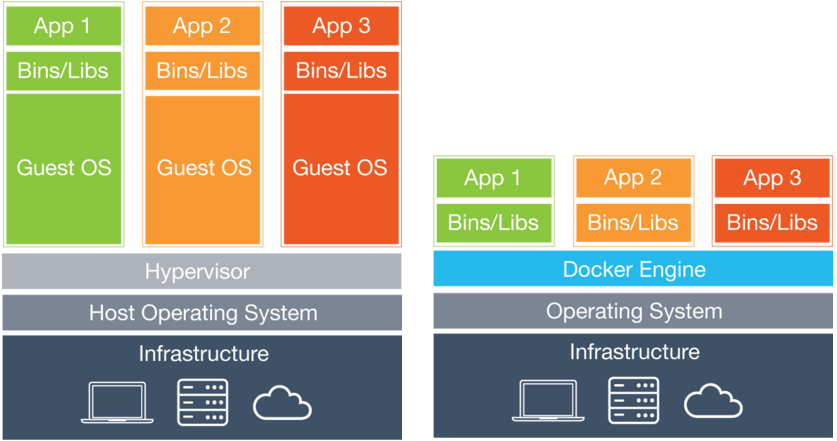

= data-x='-3000' data-y='-2000' data-scale='4' id='title'
## Container Solutions
## <div style="font-size:small;">From chroot to Rocket and Sandstorm.io</div>
### Jan Wagner <waja@cyconet.org>

<br>
<!---->

---
= data-x='0' id='chroot'
## Simple separation

* [chroot](https://en.wikipedia.org/wiki/Chroot)
  * Mostly [used](https://en.wikipedia.org/wiki/Chroot#Uses) for privilege separation and operations
  * Restrict the view on the FS

---
= data-x='1200' id='real_separation'
## Beginning of real separation

* [(BSD) jails](https://en.wikipedia.org/wiki/FreeBSD_jail)
  * sandboxed, own IP ect.
* [(Solaris) zones](https://en.wikipedia.org/wiki/Solaris_Containers)

---
= data-x='2400' id='linux_separation1'
## Early separations for Linux

* [Linux-Vserver](https://en.wikipedia.org/wiki/Linux-VServer)
  * Founded [2001](http://linux-vserver.org/Frequently_Asked_Questions#Is_this_a_new_project.3F_When_was_it_started.3F), I [started](http://log.cyconet.org/tag/vserver) using it 2006
  * Beside other [disadvantages](https://en.wikipedia.org/wiki/Linux-VServer#Disadvantages), host kernel needs to be [patched](http://linux-vserver.org/Downloads#Kernel_Patches)

---
= data-x='0' data-y='1000' id='containers1'
## Linux Containers

* Depends on [cgroups](https://en.wikipedia.org/wiki/Cgroups) and [namespace isolation](https://en.wikipedia.org/wiki/Cgroups#Namespace_isolation)
* Fully integrated into vanilla Linux kernel
* For example used by
  * [LXC](https://en.wikipedia.org/wiki/LXC)
  * [Docker](https://en.wikipedia.org/wiki/Docker_(software))
  * [rkt](https://coreos.com/rkt)
  * [runc](https://runc.io/)
  * [Unshare](http://man7.org/linux/man-pages/man1/unshare.1.html)
  * [Nspawn](http://www.freedesktop.org/software/systemd/man/systemd-nspawn.html)

---
= data-x='1200' data-y='1000' id='containers2'
## [LXC](https://en.wikipedia.org/wiki/LXC)

* Based on [Linux Containers](#containers1)
* [Founded](https://github.com/lxc/lxc/tree/lxc_0_1_0) August 2008 on work by [IBM](https://github.com/lxc/lxc/blob/lxc_0_1_0/AUTHORS)
* Since LXC 1.0 [adequate isolation](https://linuxcontainers.org/lxc/security/) can be [provided](https://www.stgraber.org/2014/01/01/lxc-1-0-security-features/)
* Lightweight virtualized (Linux) OS environments

---
= data-x='3600' data-y='1000' id='containers3'
## [Docker](https://www.docker.com/what-docker)

* [Based](https://docs.docker.com/engine/introduction/understanding-docker/#the-underlying-technology) on [Linux Containers](#containers1)
* [Uses](https://docs.docker.com/engine/introduction/understanding-docker/#union-file-systems) Union (layered) file systems
* Result: [Container format](https://docs.docker.com/engine/introduction/understanding-docker/#container-format) - libcontainer, LXC (, maybe Jails and Zones)
* Goal: [package an application](https://www.docker.com/what-docker)

---
= data-x='10000' data-y='-1000' id='dockervslxc'
## Docker vs LXC

### LXC
* Has init and multiple processes
* Single or multiple applications
* Normal OS environment and drop in replacement for VMs
* Storage is a simple bind mount, not layered by default

### Docker
* No init and not muliple processes (can be worked around with [supervisord](https://docs.docker.com/engine/articles/using_supervisord/))
* Meant for single application
* Deployment, networking, storage and orchestration via Docker toolstack
* Uses FS layers and disables storage persistence, but has [volumes](https://docs.docker.com/engine/userguide/dockervolumes/)

---
= data-x='11200' data-y='-1000' id='dockervslxc2'
## Docker vs LXC


---
= data-x='12400' data-y='-1000' id='dockervslxc3'
## Docker vs LXC

* New behaviour in terms of network, storage and management
* Developer friendly model with the Dockerfile and commits
* No knowhow of OS needed <TODO>
* Share and distribute applications via [Registry](https://docs.docker.com/registry/)

---
= data-x='0' data-y='2000' id='docker1'
## Virtual machines vs. Docker



---
= data-x='1200' data-y='2000' id='docker2'
## What might be the advantages of Docker

* Using same environment for development and production
* Isolate applications (eg. perl5 and perl6) on the same system
* Rapid deployment in large scale (in combination with Docker [Registry](https://docs.docker.com/registry/))

---
= data-x='2400' data-y='2000' id='docker3'
## Docker architecture


---
= data-x='3600' data-y='2000' id='docker4'
## Starting Docker

<a href="https://asciinema.org/a/76zqng63200nt5f3esqnf7ag5" target="_blank"></a>

---
= data-x='4800' data-y='2000' id='docker5'
## [Dockerfiles](https://gist.github.com/waja/fd40b69ac7db07093661#file-dockerfile)

<a href="https://asciinema.org/a/anwm2ve7vqc697adv553wr1rh" target="_blank"></a>

---
= data-x='6000' data-y='2000' id='docker6'
## Docker - user data?

```
&#36; telnet localhost 80
Trying 127.0.0.1...
Connected to localhost.
Escape character is '^]'.
GET / HTTP/1.1
HOST: localhost
[...]
<title\>Welcome to nginx on Debian!</title\>
[...]
```

---
= data-x='7200' data-y='2000' id='docker7'
## Docker - [persistent data](https://docs.docker.com/engine/userguide/dockervolumes/)

```
&#36; mkdir -p /tmp/nginx/ && \
  echo "Hello world" > /tmp/nginx/index.html && \
  docker run -d -p 80:80 -v /tmp/nginx/:/var/www/html \
  debian/nginx nginx
&#36; telnet localhost 80
Trying 127.0.0.1...
Connected to localhost.
Escape character is '^]'.
GET / HTTP/1.1
HOST: localhost

HTTP/1.1 200 OK
[...]
Hello world
```

---
= data-x='8400' data-y='2000' id='docker8'
## Docker - [Layered Filesystems](https://en.wikipedia.org/wiki/UnionFS#Other_implementations)


* [Images](https://docs.docker.com/engine/userguide/dockerimages/) are series of stacked, read-only (FS) [layers](https://imagelayers.io/)
* Every (FS) change result into adding a new layer
* Top layer is a thin writable layer (makes the difference between [container and image](https://docs.docker.com/engine/userguide/storagedriver/imagesandcontainers/))

---
= data-x='1000' data-y='4000' id='credits'

## Credits

* [LXC vs Docker](https://www.flockport.com/wp-content/uploads/2014/08/lxc-vs-docker5.png)
* [Virtualization diagram](https://www.docker.com/sites/default/files/what-is-docker-diagram.png)
* [Docker diagram](https://www.docker.com/sites/default/files/what-is-vm-diagram.png)
* [Docker architecture](https://docs.docker.com/engine/article-img/architecture.svg)
* [Docker - Layered Filesystems Diagram] (https://www.docker.com/sites/default/files/products/what_is_layered_filesystems_sm.png)
* [Understanding the key differences between LXC and Docker](https://www.flockport.com/lxc-vs-docker/)
* [Operating System Containers vs. Application Containers](https://blog.risingstack.com/operating-system-containers-vs-application-containers/)

---
= data-x='-3000' data-y='1000' data-scale='4' id='slides'

## Slides

* [http://waja.github.io/container_solutions/container_solutions/](http://waja.github.io/container_solutions/container_solutions/)
* License: [CC-SA-3.0-DE](https://creativecommons.org/licenses/by-sa/3.0/de/)
* Mail: Jan Wagner <waja@cyconet.org>
